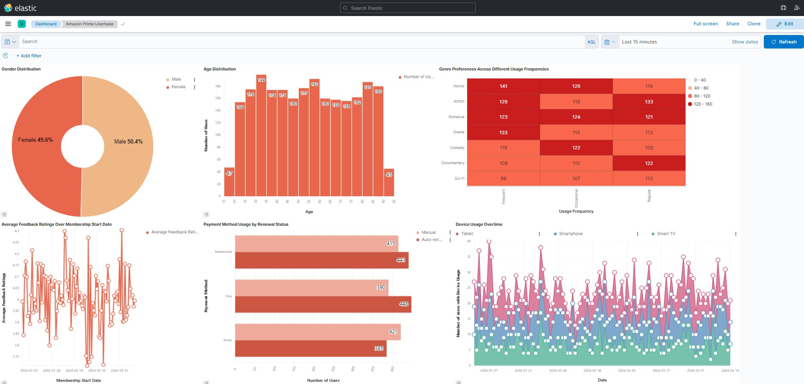
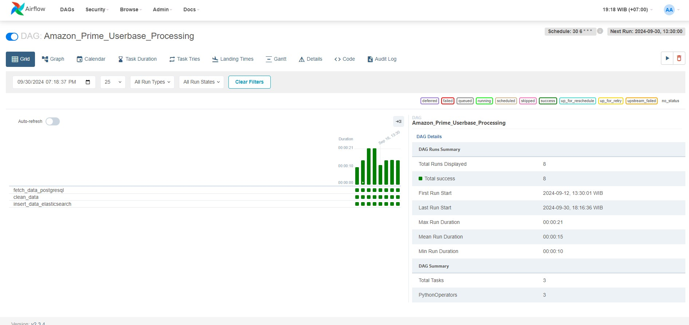
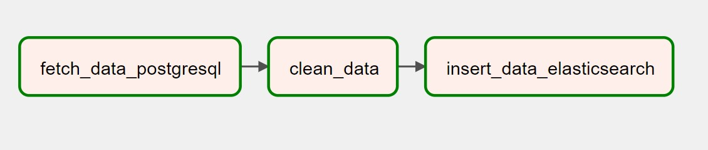

# 🎬 Amazon Prime User Analysis


## 📊 Project Overview

This project conducts an in-depth analysis of the Amazon Prime userbase dataset using advanced data processing techniques and robust quality assurance methods. It showcases the implementation of Apache Airflow for ETL processes and Great Expectations for comprehensive data validation, providing valuable insights into Amazon Prime user behavior and trends.

## 🚀 Features

- **ETL Pipeline**: Automated data extraction, transformation, and loading using Apache Airflow.
- **Data Validation**: Comprehensive data quality checks using Great Expectations.
- **Elasticsearch Integration**: Efficient data storage and retrieval for analytics.
- **Visualization**: Interactive dashboards for data exploration and presentation.
- **Scalable Architecture**: Designed to handle large datasets efficiently.

## 🛠 Technologies Used

-  Apache Airflow
-  Great Expectations
-  Elasticsearch
-  Python
-  Pandas
-  PostgreSQL
-  Docker
-  Jupyter Notebooks

## 📁 Project Structure

```
amazon-prime-user-analysis/
│
├── dashboard-kibana/
│   ├── conclusions.png
│   ├── dashboard.jpg
│   ├── introduction & objective.png
│   ├── plot & insight 01.png
│   ├── plot & insight 02.png
│   ├── plot & insight 03.png
│   ├── plot & insight 04.png
│   ├── plot & insight 05.png
│   └── plot & insight 06.png
│
├── dataset/
│   ├── dataset_cleaned.csv
│   └── dataset_raw.csv
│
├── images/
│   ├── airflow-2.jpg
│   ├── airflow.jpg
│   └── amazon-prime.jpg
│
├── validation_results/
│   ├── amazon_prime_userbase_expectations.json
│   └── validation_results.json
│
├── automation_script_DAG.py
├── data-validation-great-expectation.ipynb
├── posgresql-query.txt
└── README.md
```

## 🔧 Setup and Installation

1. Clone the repository:
   ```bash
   git clone https://github.com/your-username/amazon-prime-user-analysis.git
   cd amazon-prime-user-analysis
   ```

2. Set up a virtual environment:
   ```bash
   python -m venv venv
   source venv/bin/activate  # On Windows, use `venv\Scripts\activate`
   ```

3. Install required dependencies:
   ```bash
   pip install -r requirements.txt
   ```

4. Set up Apache Airflow:
   ```bash
   airflow db init
   airflow users create --username admin --password admin --firstname Admin --lastname User --role Admin --email admin@example.com
   ```

5. Start Airflow webserver and scheduler:
   ```bash
   airflow webserver --port 8080
   airflow scheduler
   ```

6. Set up Elasticsearch and Kibana using Docker:
   ```bash
   docker-compose up -d
   ```

## 📊 Dataset

The dataset used in this project is the Amazon Prime Userbase Dataset, available on Kaggle:
[Amazon Prime Userbase Dataset](https://www.kaggle.com/datasets/arnavsmayan/amazon-prime-userbase-dataset/data)

## 🗄️ Database Setup

The project uses PostgreSQL for data storage. Here's the SQL query used to create the database and table:

```sql
begin;

-- Create database
CREATE DATABASE airflow;

-- Create amazon_prime_userbase table
CREATE TABLE amazon_prime_userbase (
"User ID" SERIAL PRIMARY KEY,
"Name" VARCHAR(255),
"Email Address" VARCHAR(255),
"Username" VARCHAR(255),
"Date of Birth" DATE,
"Gender" VARCHAR(50),
"Location" VARCHAR(255),
"Membership Start Date" DATE,
"Membership End Date" DATE,
"Subscription Plan" VARCHAR(50),
"Payment Information" VARCHAR(50),
"Renewal Status" VARCHAR(50),
"Usage Frequency" VARCHAR(50),
"Purchase History" VARCHAR(255),
"Favorite Genres" VARCHAR(255),
"Devices Used" VARCHAR(255),
"Engagement Metrics" VARCHAR(50),
"Feedback/Ratings" NUMERIC(3,1),
"Customer Support Interactions" INTEGER
);

-- Copy data into amazon_prime_userbase
COPY amazon_prime_userbase
FROM 'C:\xampp\tmp\dataset_raw.csv'
DELIMITER ','
CSV HEADER;
```

## 🔍 Data Validation

We use Great Expectations to ensure data quality. Key expectations include:

- No missing values in critical fields
- Date fields in correct format
- Numeric fields within expected ranges
- Categorical fields containing only predefined values
- etc ...

> 💡 **Note:** For a comprehensive view of our data validation process and all expectations, please refer to the `data-validation-great-expectation.ipynb` notebook in the project root directory. This notebook contains detailed explanations, code, and results of our Great Expectations implementation.

## 📈 Visualization

The project includes interactive dashboards created using Kibana. These visualizations provide insights into:

- 👥 User demographics
- 📈 Subscription trends
- 💰 Revenue analysis
- 🌍 Geographic user distribution

<p align="center">
  
  <br>
  <em>Interactive dashboard showcasing key metrics and trends from the Amazon Prime userbase analysis</em>
</p>

## 🚀 Running the ETL Pipeline

To run the ETL pipeline:

1. Ensure Airflow is running
2. Navigate to the Airflow UI (default: http://localhost:8080)
3. Trigger the `amazon_prime_etl_dag` DAG

## 🔄 Airflow Process

Our ETL pipeline is orchestrated using Apache Airflow. Below are visual representations of our Airflow setup and DAG:

### Airflow Dashboard
<p align="center">
  
  <br>
  <em>Overview of the Airflow dashboard showing our DAGs</em>
</p>

### DAG Graph View
<p align="center">
  
  <br>
  <em>Detailed view of our Amazon Prime ETL DAG graph, showing the sequence and dependencies of tasks</em>
</p>

These images provide a clear visualization of our workflow, demonstrating the structure and flow of our data processing pipeline.

## 📚 Documentation

For more detailed information about the project components, please refer to the `docs/` directory.

## 🤝 Contributing

Contributions are welcome! Please feel free to submit a Pull Request.


---
## 📞 Contact

For any queries or feedback, please contact:

Ayudha Amari Hirtranusi- [amariayudha@gmail.com](mailto:amariayudha@gmail.com)

Project Link: [https://github.com/ayudhaamari/amazon-prime-user-analysis](https://github.com/ayudhaamari/amazon-prime-user-analysis)